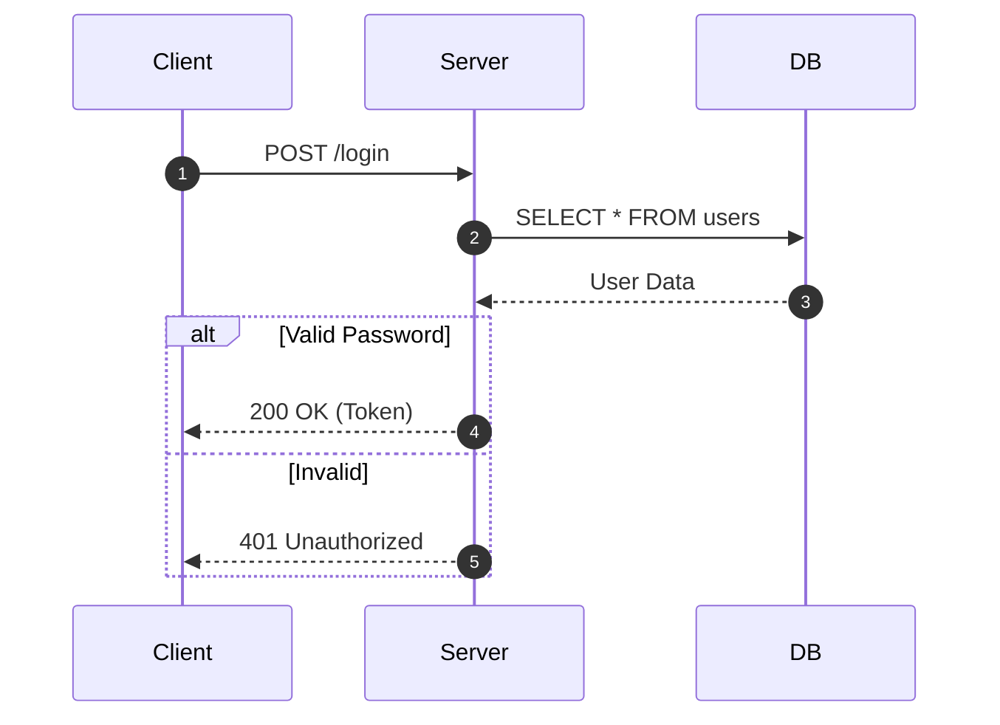
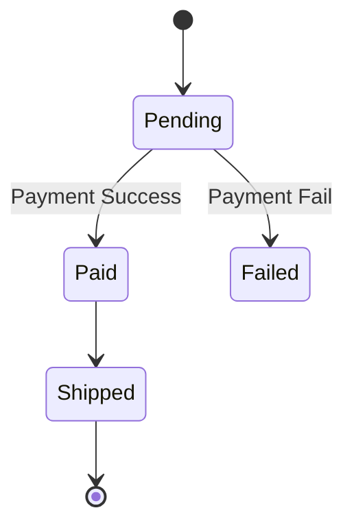
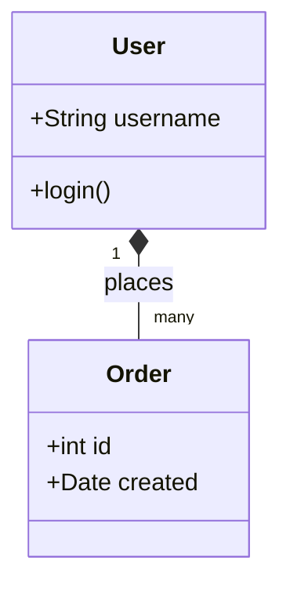
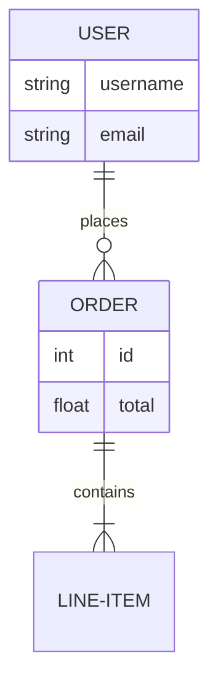
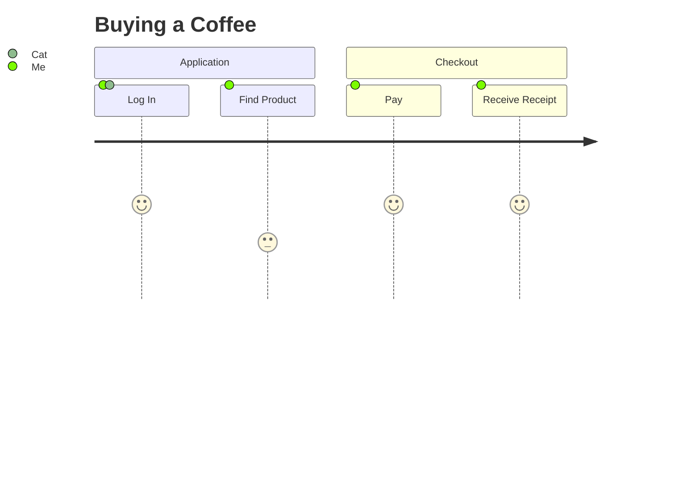
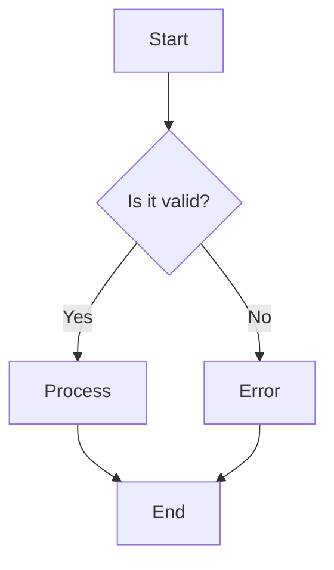

# Mermaid Diagramming Best Practices

## "Visuals First"

Diagrams are not decorations. They are **specifications**.

## 1. Syntax Verification

**ALWAYS** check `verify_mermaid.py` or use `context7` to confirm syntax if unsure. Mermaid syntax evolves.

## 2. Diagram Selection Guide

| Requirement Type       | Diagram Type  | Mermaid Key       | Why?                               |
| :--------------------- | :------------ | :---------------- | :--------------------------------- |
| **Logic/Workflow**     | Flowchart     | `flowchart TD`    | Decision trees, yes/no paths.      |
| **System Interaction** | Sequence      | `sequenceDiagram` | Who calls whom? APIreq/res cycles. |
| **Data Structure**     | Class Diagram | `classDiagram`    | OOP relationships.                 |
| **Database Schema**    | ER Diagram    | `erDiagram`       | SQL tables and cardinality.        |
| **Lifecycle**          | State Diagram | `stateDiagram-v2` | Status transitions.                |
| **User Journey**       | User Journey  | `journey`         | User sentiment/steps overlay.      |
| **Architecture**       | C4 Context    | `C4Context`       | High-level system overview.        |
| **Project Plan**       | Gantt         | `gantt`           | Timeline and milestones.           |

## 3. Style Guidelines

- **Left-to-Right** (`LR`) for long processes.
- **Top-Down** (`TD`) for hierarchies.
- **Subgraphs**: Use to group related components (e.g., `subgraph Database`).

## 4. Examples Library

### Sequence Diagram (API Call)

_Use for: API endpoints, service-to-service communication._



### State Diagram (Lifecycle)

_Use for: Order status, Auth state, Ticket workflows._



### Class Diagram (OOP/Data)

_Use for: Domain entities, Code architecture._



### ER Diagram (Database)

_Use for: SQL Schema, Relationships._



### User Journey Map

_Use for: UX Flows, Customer experience._



### C4 Context (Architecture)

_Use for: High-level System Landscape. Requires `C4Context` library support._

```mermaid
C4Context
    title System Context for Banking App
    Person(customer, "Customer", "A customer of the bank.")
    System(banking_system, "Internet Banking System", "Allows customers to view information.")
    SystemExt(mainframe, "Mainframe Banking System", "Stores all customer information.")
    Rel(customer, banking_system, "Uses")
    Rel(banking_system, mainframe, "Uses")
```

### Flowchart (Logic Tree)

_Use for: Business rules, Algorithms._


