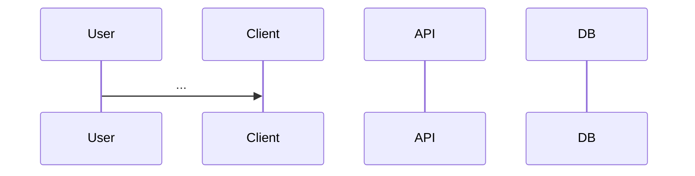

# Technical Specification

## 1. Overview

- **Feature**: [Feature Name]
- **Context**: [Brief explanation of why we are building this]
- **Scope**: [What is IN and OUT of technical scope]

## 2. Architecture Diagram (Mermaid)

_(Insert Sequence or Class Diagram here)_



## 3. Data Model (Schema)

| Table/Collection | Column/Field | Type | Constraint | Description |
| :--------------- | :----------- | :--- | :--------- | :---------- |
| `users`          | `id`         | UUID | PK         |             |
|                  |              |      |            |             |

## 4. API Interface

### Endpoint: `[METHOD] /path/to/resource`

- **Description**: ...
- **Auth Required**: Yes/No scopes
- **Request Body**:
  ```json
  {
    "field": "type"
  }
  ```
- **Response (200)**:
  ```json
  {
    "data": ...
  }
  ```
- **Error Codes**:
  - `400`: [Invalid Input Scenarios]
  - `403`: [Permission Scenarios]

## 5. Implementation Logic

- **State Management**: ...
- **Algorithms/Calculations**: ...
- **Security Considerations**: ...

## 6. Edge Cases

- [ ] Network Failure
- [ ] Concurrent Access
- [ ] Empty States
