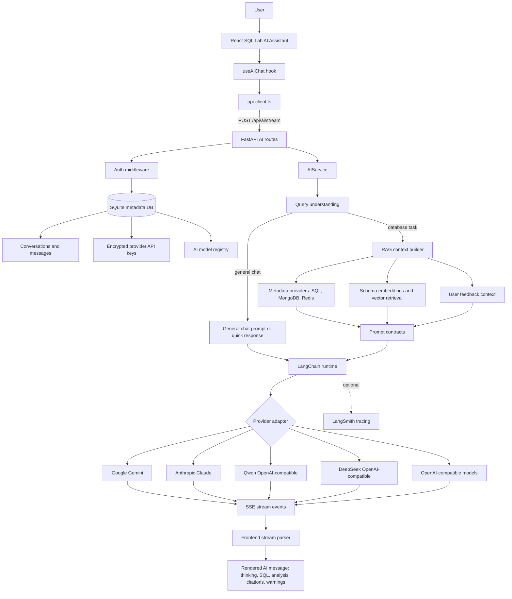

# Project Context

## Product Purpose

QurioDB is a desktop-first database management and analytics platform.

It helps technical users connect to databases, inspect schema metadata, run queries, import data, save query history, and use AI assistance for SQL generation, explanation, optimization, completion, and repair.

## Primary Target

The primary product target is the local desktop application.

The desktop app should work without requiring users to manually start a backend server. It packages a Python FastAPI backend as a Tauri sidecar process and stores system metadata in a local SQLite database by default.

## Target Users

- Developers who need a local workspace for database inspection and querying.
- Data analysts who need SQL execution, saved queries, imports, and AI-assisted analysis.
- Database administrators who need metadata browsing and diagnostics.
- Technical users working with SQL and NoSQL systems from one desktop tool.

## Core User Goals

- Connect to local or remote databases.
- Browse schemas, tables, views, columns, indexes, foreign keys, functions, procedures, triggers, and diagnostics.
- Write, execute, explain, and save SQL queries.
- Review query history and recent activity.
- Import external data files into supported databases.
- Use AI to generate SQL, explain SQL, optimize SQL, fix SQL, complete SQL, and continue query conversations.
- Run the app as a self-contained desktop experience without manually managing backend services.

## Core Product Areas

- Dashboard: high-level activity, connection overview, health, saved queries, and analytics.
- Connections: database connection creation, editing, testing, and management.
- SQL Lab: editor, schema sidebar, object panel, query execution, result grid, charts, lineage, import flow, and saved/open query dialogs.
- AI Assistant: chat, generated SQL, reasoning, feedback, model configuration, and conversation history.
- Settings: account, editor, data, general, and AI settings.
- Desktop Runtime: Tauri window, backend sidecar lifecycle, readiness gate, and local API routing.

## Architecture Summary

QurioDB is a Bun/Turbo monorepo with three main applications:

- `apps/web`: React 19, Vite, TypeScript, Tailwind CSS, TanStack Query/Table, Monaco Editor, and Zustand.
- `apps/api`: Python FastAPI backend using SQLAlchemy and a local SQLite metadata database by default.
- `apps/desktop`: Tauri 2 desktop wrapper that bundles the web UI and starts the backend as a sidecar.

At runtime, the frontend calls the backend API at `http://127.0.0.1:5000/api/` in desktop/local mode. The backend exposes health checks at `/health` and `/api/health`.

## AI Assistant Tech Stack Flow

The AI Assistant is surfaced primarily inside SQL Lab and is designed around streaming responses, database-aware RAG context, and provider-agnostic LangChain model execution.

Primary AI Assistant files:

- `apps/web/src/app/sqllab/hooks/useAIChat.ts`: frontend chat state, streaming callbacks, and event parsing.
- `apps/web/src/app/sqllab/components/AIAssistant.tsx`: SQL Lab assistant surface.
- `apps/api/routes/ai.py`: aggregate AI router.
- `apps/api/routes/ai_stream.py`: streaming chat endpoint and persisted stream snapshots.
- `apps/api/routes/ai_generation.py`: SQL generation, explanation, optimization, repair, autocomplete, and agent endpoints.
- `apps/api/services/ai_service.py`: AI service coordinator for streaming, SQL tasks, RAG, feedback context, and LangChain execution.
- `apps/api/services/ai/langchain_runtime.py`: provider resolution, model construction, OpenAI-compatible message handling, and LangSmith metadata.
- `apps/api/services/ai/retrieval/*`: schema retrieval, ranking, embedding, and vector context services.
- `apps/api/models/ai_chat_message.py`, `apps/api/models/ai_conversation.py`, `apps/api/models/user_ai_config.py`, and `apps/api/models/ai_model.py`: metadata persistence for chat, provider keys, and model registry.

## Desktop Runtime Flow

1. Tauri starts the main desktop window.
2. Rust code in `apps/desktop/src-tauri/src/lib.rs` spawns the backend sidecar with `shell.sidecar("api")`.
3. The sidecar launches the FastAPI backend on `127.0.0.1:5000`.
4. Tauri polls `http://127.0.0.1:5000/health`.
5. When the backend is ready, Tauri emits the `backend-ready` event.
6. The frontend `DesktopReadyGuard` receives `backend-ready` and renders the main app.
7. On close or exit, Tauri terminates the backend sidecar. On Windows, it uses `taskkill /F /T /PID` to clean up the process tree.

## Desktop Constraints

- Desktop reliability is more important than web-only convenience.
- Backend changes that affect desktop runtime must consider PyInstaller packaging and sidecar rebuilds.
- Frontend API behavior must work in both browser dev mode and Tauri WebView mode.
- The backend should bind to `127.0.0.1` by default to avoid Windows firewall prompts.
- Health checks must stay fast and stable because desktop startup depends on them.
- The packaged desktop app must not depend on a manually started API server.

## Important Files

- `AGENTS.md`: agent working instructions and desktop-first guidance.
- `README.md`: developer-facing project overview.
- `apps/web/src/App.tsx`: frontend routing entry point.
- `apps/web/src/lib/api-client.ts`: main API client and desktop/local URL resolution.
- `apps/web/src/components/desktop-ready-guard.tsx`: Tauri backend readiness gate.
- `apps/api/app.py`: FastAPI application entry point.
- `apps/api/models/metadata.py`: SQLAlchemy metadata models and local database initialization.
- `apps/desktop/src-tauri/src/lib.rs`: Tauri sidecar lifecycle, health check, and shutdown logic.
- `apps/desktop/src-tauri/tauri.conf.json`: Tauri build and bundle configuration.
- `build-backend.ps1`: PyInstaller backend sidecar build script.

## Non-Goals

- QurioDB should not require users to install or manage a separate system database for basic app metadata.
- The desktop app should not require a visible backend console window.
- The frontend should not assume the API is always reachable immediately during desktop startup.
- Web-only behavior should not break the packaged desktop runtime.

## Agent Guidance

Before making product, architecture, UI, backend, or desktop changes, read this file together with `AGENTS.md`.

When a task touches desktop behavior, verify the impact on:

- Sidecar packaging.
- Backend startup and health checks.
- API base URL resolution.
- Tauri `backend-ready` event behavior.
- Sidecar shutdown cleanup.

Related documentation:

- [[Specs-MOC]]
