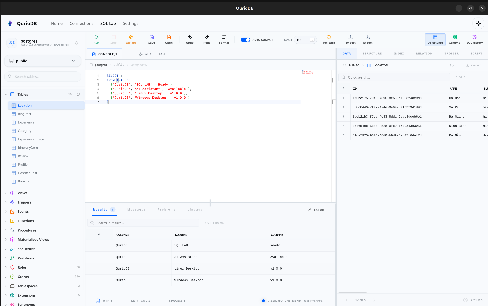
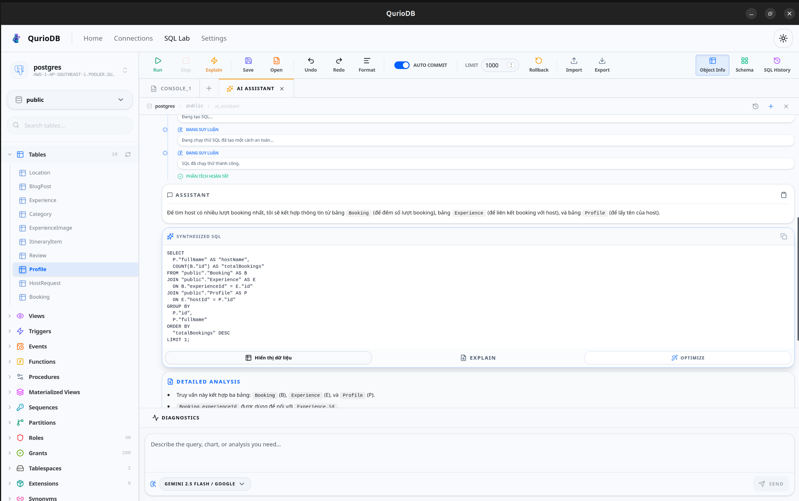
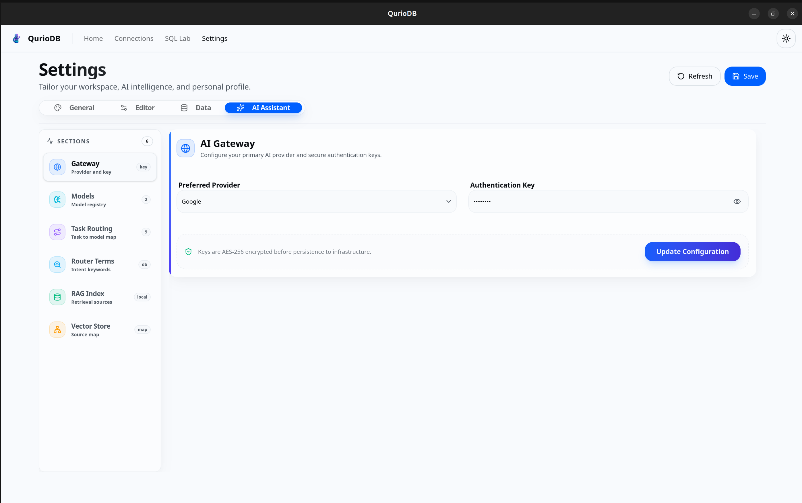
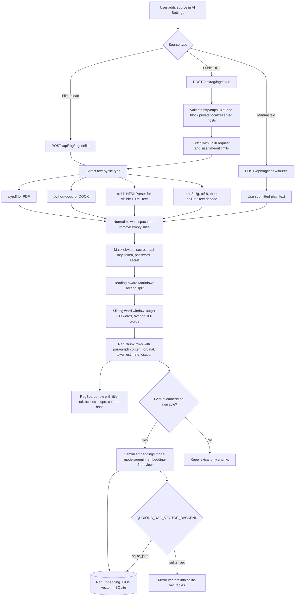
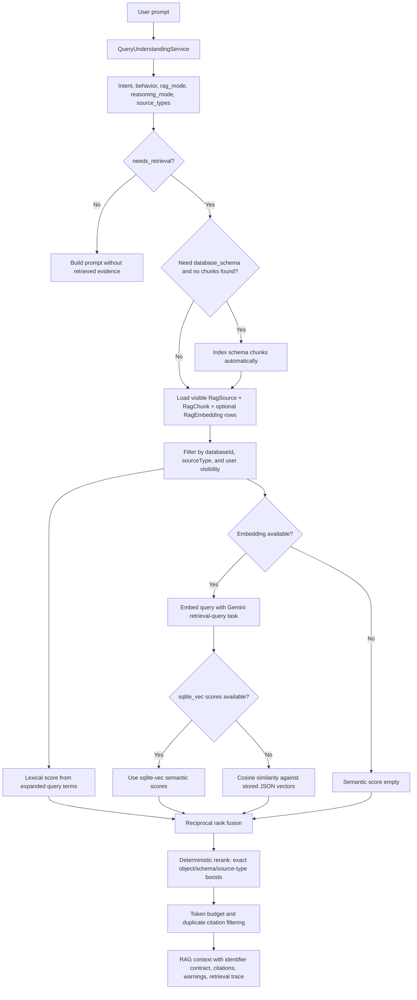

# QurioDB

QurioDB is a desktop-first database management and analytics platform built with a React/Vite frontend, a FastAPI backend, and a Tauri desktop shell.

The desktop app is the primary target. It bundles the React UI and starts the Python API as a local sidecar process, so users do not need to run a backend manually.

## ✨ See QurioDB In Action

SQL Lab brings database browsing, SQL editing, and query results together in one workspace.



*SQL Lab running a sample query with tabular results.*



*AI Assistant generating SQL from a natural-language request.*

## 🚀 Quick Launch

This project includes local scripts for easy startup:

- **Web Browser Version**: double-click `run-web.bat` to launch the API and open the web interface.
- **Desktop Application**: double-click `run-desktop.bat` to launch the standalone desktop app.

## 📦 Desktop Application (.msi / .exe)

The desktop app is built with Tauri 2 and includes an embedded Python FastAPI sidecar for local/offline operation.

### ⬇️ Download Windows Installers

- [Download Windows Installer (v1.0.0)](https://github.com/trungvinh2102/QurioDB/releases/download/v1.0.0/QurioDB_1.0.0_x64_en-US.msi)
- [Download Windows Setup (v1.0.0)](https://github.com/trungvinh2102/QurioDB/releases/download/v1.0.0/QurioDB_1.0.0_x64-setup.exe)

### 🐧 Download Linux Installers
- [Download Linux Package (v1.0.0)](https://github.com/trungvinh2102/QurioDB/releases/download/v1.0.0/QurioDB_1.0.0_amd64.deb)

This link points to the current stable release. To download the latest official version, visit the [Releases Page](https://github.com/trungvinh2102/QurioDB/releases).

### 🔨 Build from Source

To generate a fresh `.msi` installer:

1. Ensure all dependencies are installed: `bun install`
2. Build the desktop package:

   ```bash
   bun run desktop:build
   ```

3. The setup file is generated under `apps/desktop/src-tauri/target/`.

## 🏗️ Architecture

- **Frontend (`apps/web`)**: React 19, Vite 6, TypeScript, Tailwind CSS 4, shadcn-style primitives, TanStack Query/Table, Monaco Editor, and Zustand.
- **Backend (`apps/api`)**: FastAPI, SQLAlchemy, SQLite metadata storage, database connectors, import flows, and AI/RAG services.
- **Desktop (`apps/desktop`)**: Tauri 2 wrapper with single-instance enforcement, dynamic loopback FastAPI sidecar startup, nonce-authenticated readiness, and shutdown cleanup.

### Desktop startup

The desktop shell keeps one running instance and focuses the existing window when a second launch is attempted. On each launch, Rust allocates an available loopback port and a per-launch startup nonce, then passes `QURIODB_DESKTOP_PORT`, `QURIODB_STARTUP_NONCE`, `QURIODB_DESKTOP_PARENT_PID`, and the desktop-only sidecar settings to the bundled API. Rust verifies `GET /api/desktop/health` with that nonce before publishing the typed API URL and generation state to the React frontend. The frontend configures its API client before rendering the desktop application; startup failures remain actionable through **Retry** and **Quit**.

Browser development remains independent of this flow and defaults to `http://127.0.0.1:5000/api/` unless `VITE_API_URL` is set.

## 🛠️ Setup & Development

### 📋 Requirements

- Bun 1.3.6+
- Node.js 20+
- Python 3.10+
- Rust/Cargo for desktop builds

### 📥 Installation

```bash
bun install
pip install -r apps/api/requirements.txt
```

### 🗄️ Database Setup

QurioDB uses SQLite automatically for its internal system metadata.

On first run, it creates a local database file at:

```text
~/.quriodb/quriodb.db
```

No external system database is required for the app metadata store.

### 🌱 Initialize & Seed

The backend initializes tables on first run. If you want to seed default data manually:

```bash
python apps/api/scripts/seed.py
```

Default admin credentials are `admin` / `password123` when no users exist.

### ▶️ Running in Development

```bash
# Start web and API
bun run dev

# Start only the web app
bun run dev:web

# Start only the backend
bun run dev:backend
```

### 🔄 Desktop Sidecar Sync

If you modify Python code under `apps/api/` and need those changes in the desktop app, rebuild the sidecar:

```powershell
powershell -ExecutionPolicy Bypass -File build-backend.ps1
```

Tauri uses prebuilt sidecar binaries from `apps/desktop/src-tauri/bin/`. Without a rebuild, the desktop app can keep running an older `api.exe`.

## ⚙️ Environment Configuration

The frontend resolves API URLs automatically for browser development and Tauri desktop mode.

To customize the API target during a Vite build, set:

```powershell
$env:VITE_API_URL="http://127.0.0.1:5000/api/"
```

## 🤖 AI Assistant

QurioDB's AI Assistant is available primarily in SQL Lab and is configured from **Settings -> AI Assistant**. It supports chat, SQL generation, explanation, optimization, repair, autocomplete, safe agent execution, conversation history, feedback, diagnostics, and database-aware RAG.



*AI Assistant settings for provider and encrypted authentication key configuration.*

### 🧠 AI Runtime

The backend uses LangChain as the provider runtime and keeps OpenAI-style chat messages as the internal message format. Provider adapters currently support:

- OpenAI-compatible models
- Google Gemini
- Anthropic Claude
- Qwen
- DeepSeek

Provider API keys are stored from **Settings -> AI Assistant** in QurioDB's encrypted local metadata database. Desktop users should configure provider keys through the app UI instead of passing keys through environment variables.

Qwen and DeepSeek default to OpenAI-compatible endpoints. Override them only when needed:

```powershell
$env:QWEN_BASE_URL="https://dashscope-intl.aliyuncs.com/compatible-mode/v1"
$env:DEEPSEEK_BASE_URL="https://api.deepseek.com"
```

### 🧩 AI Settings

The AI settings screen manages:

- **AI Gateway**: preferred provider and encrypted API key.
- **Model Library**: available models, default models, active status, and model capabilities.
- **Task Routing**: per-task model assignment and fallback models for SQL tasks.
- **Router Terms**: intent and behavior routing terms that control shallow/deep RAG and reasoning modes.
- **RAG Index**: database schema sync, saved-query sync, optional query-history sync, file/URL/text ingestion, and retrieval evaluation.
- **Vector Store Map**: visual inspection of indexed sources, chunks, pipeline stages, and vector backend status.

### 🔎 RAG Pipeline

RAG is enabled by default and is desktop-safe. The default vector backend is SQLite JSON storage, with optional `sqlite_vec` acceleration when available.

The RAG layer can index:

- database schemas
- saved queries
- query history, only when explicitly enabled
- uploaded files: PDF, DOCX, Markdown, text, and HTML
- public URLs
- manually entered text

Core RAG endpoints are exposed under `/api/rag`, including:

- `GET /api/rag/status`
- `GET /api/rag/pipeline/status`
- `POST /api/rag/pipeline/sync/database/{database_id}`
- `POST /api/rag/pipeline/plan`
- `POST /api/rag/ingest/file`
- `POST /api/rag/ingest/url`
- `POST /api/rag/evaluate`

RAG environment controls:

```powershell
$env:QURIODB_RAG_ENABLED="true"
$env:QURIODB_RAG_VECTOR_BACKEND="sqlite_json" # sqlite_json or sqlite_vec
$env:QURIODB_RAG_RERANK_ENABLED="true"
$env:QURIODB_RAG_INGEST_MAX_BYTES="10485760"
$env:QURIODB_RAG_INGEST_URL_TIMEOUT="10"
```

URL ingestion blocks private, local, and reserved hosts by default. For local research only, this can be relaxed with:

```powershell
$env:QURIODB_RAG_ALLOW_PRIVATE_URLS="true"
```

### 📚 Document Indexing And Chunking Flow

Document ingestion uses desktop-safe local parsers first, then passes extracted text into the generalized RAG indexer.



Chunking strategies by source:

- **Documents and web pages**: heading-aware Markdown section split, then sliding word windows of about 700 words with 100-word overlap.
- **Database schema**: one object-aware table chunk per table, plus one compact `schema_graph` chunk for relationships and join planning.
- **Saved queries**: one reusable SQL knowledge chunk per saved query.
- **Query history**: one query chunk per history item after masking quoted strings and numeric literals.

### 🔍 Retrieval Flow

When an AI stream needs database or document context, QurioDB retrieves chunks with a hybrid lexical/semantic path and keeps permission filtering inside the local metadata store.



## 📄 License

Internal Development - Nguyễn Trung Vĩnh.

---

QurioDB - v1.0.0
